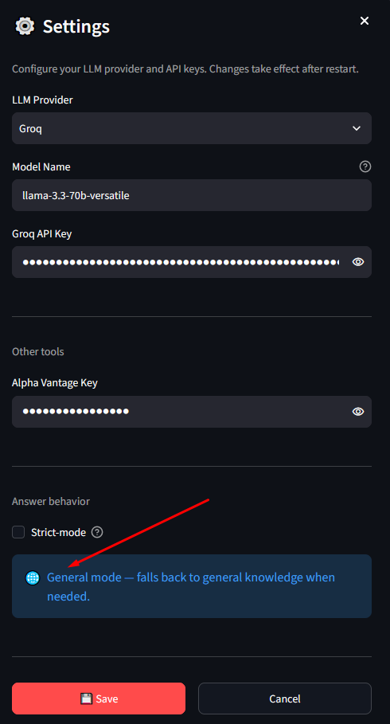
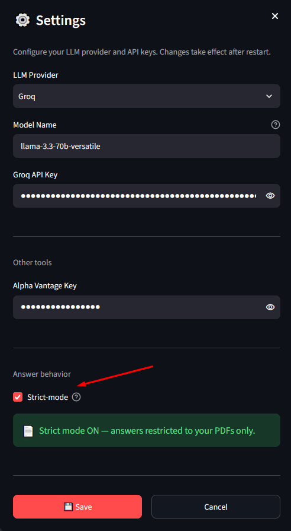
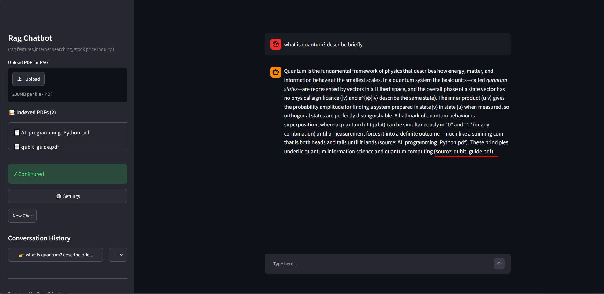
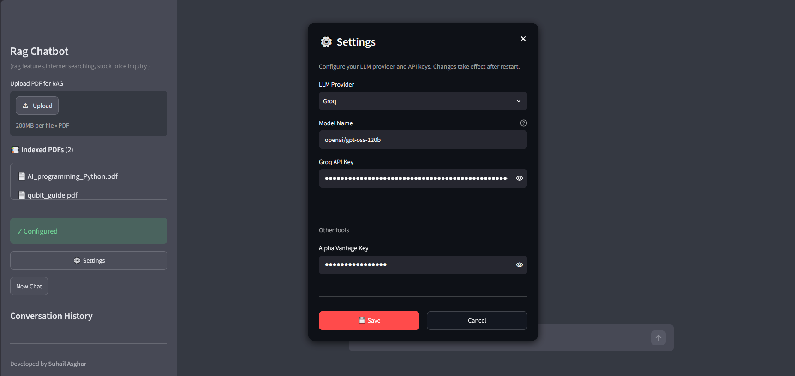

RAG Chatbot (2026) — Chat with Your PDFs

A desktop RAG (Retrieval-Augmented Generation) chatbot that lets you ask questions across multiple PDFs and get answers with the exact source file cited.

Supports live stock prices, web search, and any LLM provider you choose — Groq, OpenAI, or a local model.

Note: This is a closed-source tool. The source code is not publicly available.
The ready-to-run Windows desktop version will be available soon on [Gumroad](https://autopy.gumroad.com/l/fpfcp).

---

## ▶️ Watch the Demo

*Click the thumbnail to watch the full 9-minute walkthrough on YouTube — upload, ask, cite, verify.*

- **Full walkthrough (9 min):** [youtu.be/7Tg3wUYisHE](https://youtu.be/7Tg3wUYisHE)
- **Short clip (90 s):** [Watch on Facebook](https://www.facebook.com/autopyai)

---

## ✨ Features

- **Multiple PDFs indexed at once** — Upload any number of PDFs, on any topic, and ask across all of them.
- **Answers that cite the exact source file** — Every response shows the file it came from, e.g. `(source: qubit_guide.pdf)`. No guessing, no hallucinations.
- **Honest fallbacks** — If the PDFs don't cover something, the chatbot says so and clearly labels any answer drawn from general knowledge.
- **Live stock prices** — Asks Alpha Vantage for real-time stock data, with retry and timeout handling.
- **Web search** — Uses DuckDuckGo for current events and anything not in the PDFs.
- **Threaded conversations** — Every chat is saved and persistent across restarts. Click any past topic to reload it.
- **Bring your own LLM** — Groq, OpenAI, Anthropic, or a local model. Your API key, your choice.
- **Simple GUI** — Clean Streamlit-based interface any beginner can operate.
- **Runs locally** — Your documents and keys never leave your machine.

## 🎛️ Two Modes

Switch between modes in **⚙️ Settings**.

### 🌐 General mode (default)

Answers from your PDFs when possible, and falls back to general knowledge when the documents don't cover a topic. Fallbacks are clearly labeled.

*The default mode — helpful, with clear source labels.*

### 📄 Strict document-only mode

For legal, medical, and financial use cases. Answers *only* from your uploaded PDFs. If the documents don't cover a topic, the assistant refuses instead of guessing.

*Strict mode — answers come only from your documents.*---

Real Output Examples

▶️ **[Watch the full walkthrough on YouTube →](https://youtu.be/7Tg3wUYisHE)**

Then scroll down for screenshots.

1. Ask a question — get a cited answer

User: What is the Hamming code?

Assistant: Hamming codes are a family of linear error-correcting codes invented by Richard Hamming in the late 1940s. A classic example is the binary [7,4,3] Hamming code, which encodes 4 data bits into 7 bits by adding 3 parity bits.
(source: qubit_guide.pdf)

2. Honest fallback when the PDFs don't cover it

User: Define a cursor.

Assistant:The PDFs don't contain a definition of "cursor." From general knowledge: a cursor is a movable indicator — often a blinking vertical line in a text editor — that shows the current position where input will be inserted.

3. Live stock price with source tag

User:What's the stock price of Adobe?

Assistant:The latest price for Adobe (ADBE) is $248.92 per share.

(source: get_stock_price)

4. Sidebar with indexed PDFs and conversation history

The sidebar shows every indexed PDF and all saved conversations.

5. Answer with citations in the main chat area

### 5. Answer with citations in the main chat area

*Every answer carries a source tag so the user can verify.*

6. Settings — bring your own LLM

Choose your provider, model, and API key. Groq, OpenAI, Anthropic, or local.

---

How to Use

1. Download the Windows installer from [Gumroad](https://autopy.gumroad.com/l/fpfcp) (coming soon).
2. Run the app — no Python installation required.
3. Open Settings in the sidebar and enter:
   - Your LLM provider (Groq, OpenAI, Anthropic, or Ollama)
   - Your model name
   - Your API key
   - Your Alpha Vantage key (free tier is fine)
4. Upload PDFs using the sidebar uploader. Wait for indexing to finish.
5. Ask questions in the chat box. Answers will cite the source file.
6. Browse history — every conversation is saved. Click any topic in the sidebar to reopen it.

---

Perfect For

- Researchers managing hundreds of papers and books
- Lawyers and legal teams, searching contracts, case files, and precedents
- Engineers and students, working through large technical manuals
- Business consultants, navigating client documents and reports
- Doctors and medical staff, searching clinical guidelines and literature
- Anyone with a growing pile of PDFs they can never quite search

---

Privacy & Trust

- Built by Suhail Asghar — MCS, freeCodeCamp certified
- 100% local execution — your documents stay on your machine. Nothing is sent to any server except the LLM provider you choose.
- Your API keys, your account — no routing through third-party services.
- No ads, no telemetry — the app does not phone home.
- Honest AI — answers cite sources. If the model doesn't know, it says so.

---

What's Next?

- Coming soon on [Gumroad](https://autopy.gumroad.com)
- Future additions:
  - Urdu and non-Latin script PDF support (via Surya OCR)
  - Image extraction from PDFs (multi-modal RAG)
  - Agentic workflows with more tools
  - macOS and Linux builds

---

Tags

`rag` · `langchain` · `langgraph` · `streamlit` · `faiss` · `pdf-chatbot` · `llm` · `groq` · `openai` · `python` · `desktop-app` · `chat-with-pdf` · `document-search` · `vector-database`

---

Developed by Suhail Asghar

Python · LangChain · LangGraph · RAG systems · AI automation

- Email: autopyai@gmail.com
- LinkedIn: [linkedin.com/in/suhail-asghar](https://www.linkedin.com/in/suhailasghar)
- YouTube: [RAG Chatbot Demo](https://youtu.be/7Tg3wUYisHE)
- Facebook: [facebook.com/autopyai](https://www.facebook.com/autopyai)
- Portfolio: [autopyai.github.io](https://autopyai.github.io)
- Gumroad: [autopy.gumroad.com](https://autopy.gumroad.com)
